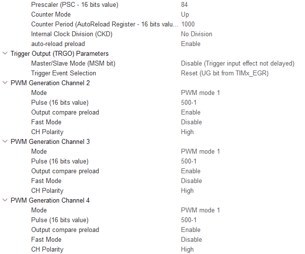
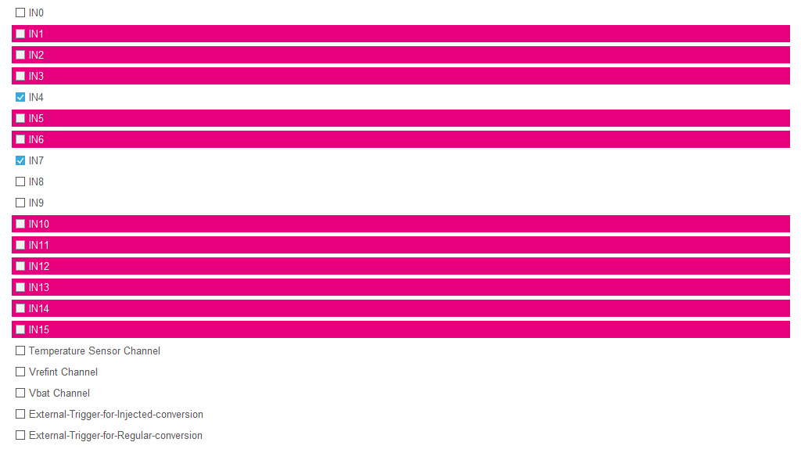

# 기획

<aside>

### 🔹기능

---

- [x]  차량, 보행자 신호등 상태를 LED에 PWM을 사용해서 표시
- [x]  차량, 보행자 신호등의 남은 시간을 7-Segment에 표시
- [x]  버튼을 누르면 PWM 출력 제어해 LED 밝기 제어
- [x]  가변 저항으로 신호등 밝기 조절
- [ ]  조도 센서로 밤,낮을 구분
    - 밤 - 보행자가 적으니 차량 신호등 시간을 늘림.

### 🔹사용 부품

---

- LED - 5개 → 차량 신호등 3개, 보행자 신호등 2개
- 7-Segment
- 버튼 - 2개 → 내부풀업 저항 사용
- 가변저항
- 조도센서
- 220Ω **-** 13개 → led, 7-Segment
- 10kΩ **- 1**개 → 조도센서

### 🔹패리패럴

---

- **GPIO** - OUTPUT - 7-Segment
- **GPIO** - INPUT - Interrupt - 버튼
- **타이머** - PWM - LED5개
- **ADC** - 가변저항, 조도센서
</aside>

# 회로 결선

<aside>


</aside>

# 핀 설정

<aside>

### 🔹Pinout View

---

<aside>


</aside>

### 🔹Clock - 클럭

---

- RCC
    - AHB1_클럭은 84MHz를 사용함.
        - 주변장치는 - 42MHz를 사용.
        - 타이머는 - 84MHz를 사용.
    
    <aside>
    
    
    
    </aside>
    
- Clock Configuration
    
    <aside>
    
    
    
    </aside>
    

### 🔹GPIO 설정

---

<aside>


</aside>

### 🔹Timer - 타이머

---

- TIM2
    
    <aside>
    
    
    
    
    
    </aside>
    
- TIM3
    
    <aside>
    
    
    
    
    
    </aside>
    

### 🔹ADC

---

<aside>



</aside>

<aside>


</aside>

### 🔹NVIC - 인터럽트 설정

---

<aside>


</aside>

### 🔹USART2 - printf 사용

<aside>


</aside>

</aside>

# 패리페럴 정리

<aside>

### 🔷 GPIO

---

- MX_GPIO_Init() 함수를 분석하면서 레지스터에 값이 어떻게 설정되는지 알아보자
    - MX_GPIO_Init() 함수 코드
        
        ```c
        static void MX_GPIO_Init(void)
        {
          GPIO_InitTypeDef GPIO_InitStruct = {0};
          /* USER CODE BEGIN MX_GPIO_Init_1 */
        
          /* USER CODE END MX_GPIO_Init_1 */
        
          /* GPIO Ports Clock Enable */
          __HAL_RCC_GPIOC_CLK_ENABLE();
          __HAL_RCC_GPIOA_CLK_ENABLE();
        
          /*Configure GPIO pin Output Level */
          HAL_GPIO_WritePin(GPIOC, segment_dot_Pin|segment_1_Pin|segment_2_Pin|segment_3_Pin
                                  |segment_4_Pin|segment_5_Pin|segment_6_Pin|segment_7_Pin, GPIO_PIN_RESET);
        
          /*Configure GPIO pins : segment_dot_Pin segment_1_Pin segment_2_Pin segment_3_Pin
                                   segment_4_Pin segment_5_Pin segment_6_Pin segment_7_Pin */
          GPIO_InitStruct.Pin = segment_dot_Pin|segment_1_Pin|segment_2_Pin|segment_3_Pin
                                  |segment_4_Pin|segment_5_Pin|segment_6_Pin|segment_7_Pin;
          GPIO_InitStruct.Mode = GPIO_MODE_OUTPUT_PP;
          GPIO_InitStruct.Pull = GPIO_NOPULL;
          GPIO_InitStruct.Speed = GPIO_SPEED_FREQ_LOW;
          HAL_GPIO_Init(GPIOC, &GPIO_InitStruct);
        
          /*Configure GPIO pins : push_btn1_Pin push_btn2_Pin */
          GPIO_InitStruct.Pin = push_btn1_Pin|push_btn2_Pin;
          GPIO_InitStruct.Mode = GPIO_MODE_INPUT;
          GPIO_InitStruct.Pull = GPIO_NOPULL;
          HAL_GPIO_Init(GPIOA, &GPIO_InitStruct);
        
          /* USER CODE BEGIN MX_GPIO_Init_2 */
        
          /* USER CODE END MX_GPIO_Init_2 */
        }
        ```
        

- 클럭 활성화

```c
__HAL_RCC_GPIOA_CLK_ENABLE();
// GPIOA를 사용하려면 
// GPIOA의 클럭을 제어하는 AHB1ENR 레지스터에서
// GPIOA에 해당하는 비트를 1로 SET 시켜줘야됨.
```

<aside>

**<데이터 시트 P.114>**


</aside>

- GPIO 입출력 기능 설정.

```c
typedef struct
{
  uint32_t Pin;
  // 설정할 핀을 지정함.
  // GPIOA_0 ~ GPIOA_15
  uint32_t Mode;      
  // 핀의 동작 모드를 설정함.
  // 인풋, 아웃풋 모드
  // 푸시풀, 아날로그, 라이징 인터럽트 모드 등등
  uint32_t Pull;
  // 핀의 Pull-up, Pull-down 모드를 설정함.
  uint32_t Speed;   
  // 핀의 동작 속도를 설정함.
  uint32_t Alternate;
  // gpio핀의 패리패럴을 설정함.
  // I2C, SPI, UART 등등
}GPIO_InitTypeDef;

GPIO_InitTypeDef GPIO_InitStruct = {0};

GPIO_InitStruct.Pin = push_btn1_Pin|push_btn2_Pin;
GPIO_InitStruct.Mode = GPIO_MODE_INPUT;
GPIO_InitStruct.Pull = GPIO_NOPULL;

HAL_GPIO_Init(GPIOA, &GPIO_InitStruct);

1. 구조체의 멤버 변수를 특정 (옵션)값으로 초기화 함.
2. 설정할 gpio핀 시작 주소와, 옵션으값으로 초기화한 구조체 주소를
		HAL_GPIO_Init() 함수에 넘기면 함수 안에서 GPIO 레지스터에 값을 넣어서
		초기화 하도록 동작함.

```

<aside>

**<데이터 시트 P.153>**

- **GPIOx_MODER**(GPIO port mode register)
- **GPIOx_OTYPER**(GPIO port output type register)
- **GPIOx_OSPEEDR**(GPIO port output speed register)
- **GPIOx_PUPDR**(GPIO port pull-up/pull-down register)
- **GPIOx_IDR**(GPIO port input data register)
- **GPIOx_ODR**(GPIO port output data register)
- **GPIOx_BSRR**(GPIO port bit set/reset register)
- **GPIOx_LCKR**(GPIO port configuration lock register)
- **GPIOx_AFRL**(GPIO alternate function low register)
- **GPIOx_AFRH**(GPIO alternate function high register)
</aside>

### 🔷 타이머 / 카운터 기본 개념

---

- **범용 타이머 상세 구조도**
    
    
    
- **타이머 : 사용자가 원하는 시간을 만드는 기능.**
    - 예시
    - 1초마다 인터럽트를 발생시켜서
    - 모터, LED, 센서값을 받아옴.
    - 위와 같은 처리를 함.
- **카운터 : 사용자가 원하는 시간을 만들기 위해 필요함.**
    - 설정한 주파수의 사이클마다 카운터 횟수를 증가 시킴.
    - 횟수를 정해주도
    - 정해진 횟수에 카운터 횟수가 도달하면 인터럽트를 발생 시킬 수 있음.
- **프리스케일 = 분주비 : 타이머에 사용하는 클럭의 주파수를 조절함.**
    - 84MHz의 클럭과 16비트 카운터를 이용해서 시간을 만들경우
    - (1 / 84MHz) * 65,536 = 약 0.78ms의 초밖에 만들지 못함.
    - 실제로는
    - 공급되는 클럭을 분주비로 나누어 카운터의 동작 클럭으로 만들어냄.
- **정리**
    - **`프리스케일`과 `카운터`**를 적절히 조합해서 사용자가 원하는 **`타이머(=시간)`**을 만들어냄.

### 🔷 타이머 / 카운터 용어 정리

---

`PSC` : 프리스케일러(Prescaler)

`ARR` : 오토-리로드 레지스터(Auto Reload Register)

`CCR` : 캡쳐 / 비교기 레지스터(Capture / Compare Register)

`ETR` : 외부 트리거(External Tegister)

`CNT` : 카운터

`Counter Period` : 사용자가 설정한 인터럽트 발생 주기

### 🔷 범용 타이머 / 카운터

---

- **업 카운팅 모드**
    - Counter Period 에서 값과 CNT 값이 증가하다 같아지면 인터럽트 발생
- **다운 카운팅 모드**
    - 업 카운팅과 반대로 동작함.
- **업 / 다운 카운팅 모드**
    - center-aligned 모드라고도 함.
    - UP → DOWN → UP → DOWN 을 반복하며 카운팅을 계속 함.
    - 언터 플로우는 0이 되면,
    - 오버 플로우는 Counter Period에서 설정한 값 도달 하면
    - 업데이트 이벤트가 발생함.
- **입력 캡쳐 모드**
    - 외부 입력 신호의 주파수를 알고 싶을때 사용함.
    - 펄스 신호의 입력만 가능하고
    - `rising` , `Falling` 과 같은 Edge를 검출해서 CNT를 하고 주파수를 계산할 수 있음.
- **출력 비교 모드**
    - Counter Period에 설정한 값과 같아지면
    - High, Low, Toggle과 같은 기능을 출력으로 보내줄 수 있음.
- **PWM 출력 모드**
    - 시작 신호를 High, Low로 설정이 가능하고
    - Counter Period와 CNT 값이 같아지면 신호를 반전시킴.
    - Counter Period를 조절하면 Duty Cycle을 조절 가능하다.
- **원 펄스 모드**
    - 외부 입력을 감지해서 일정 시간이 지난후에 펄스를 한번 발생 시키는 모드
    - 펄스의 발생 시간과 펄스의 지속 시간은 사용자가 조절이 가능하다.
    

### 🔷  ADC

---

- **ADC 설정**
    - AD 변환기
        - 레귤러 그룹(Regular group)
            - 16비트 레귤러 레지스터 1개
            - 외부 트리거에 의해서 동작(타이머 인터럽트)
        - 인젝티드 그룹(injected group)
            - 16비트 레귤러 레지스터 4개
            - 외부 트리거에 의해서 동작(타이머 인터럽트)

<aside>


<aside>

🔸**ADC_Settings**

- **스캔 모드(Scan Conversion Mode)**
    - 1, 2, 3번 입력이 들어올때 1, 2, 3번 순서대로 처리하는 방식
- **연속 모드(Continuous Conversion Mode)**
    - 입력이 들어오면 바로 변환하는 모드
    - 대기열이 쌓여 있으면 대기열 대로 처리
- **비연속 모드(DisContinuous Conversion Mode)**
    - 처리할 개수를 정해둠.
    - 1,2,3,4,5,6,7,8의 변환 순서가 있을때
    - 처리할 개수가 3개라면
    - 1,2,3번 처리
    - 4,5,6번 처리
    - 7,8번 처리하고 EOC 플래그 발생함.
- **DMA(다이나믹 메모리 액세스)**
    - CPU의 처리를 거치지 않고 바로 메모리에 저장된 데이터를
    - 처리할 곳에서 가져감.
</aside>

<aside>

🔸**ADC_Regular_ConversionMode - 레귤러 그룹**

- 입력 ADC 채널을 16개를 처리 가능함.
- 하나가 변환되면 변환된 데이터가 Data Register(BUF)에 저장됨.
- 변환된 데이터가 레지스터에 저장되면 EOF가 발생하고 EOF로 발생을 처리하면
- 다음 변환을 시작함.

🔸**ADC_Injected_ConversionMode - 인젝티드 그룹**

- 입력 ADC 채널을 4개를 처리 가능함.
- 4개의 입력을 동시에 변환이 가능하고
- 변환된 4개의 데이터를 각각의 Data Register에 저장이 가능하다.
</aside>

</aside>


</aside>