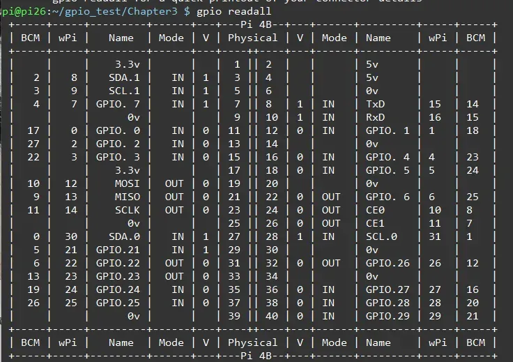
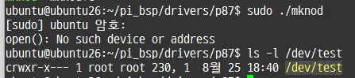
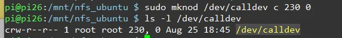
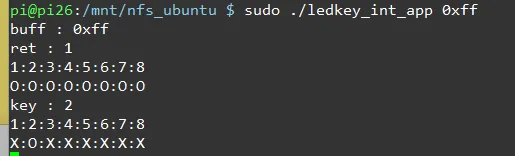

led0~7 → GPIO 6~13

스위치0~7 → GPIO 16~23

Vcc는 3.3v

# gpio_test

경로 : /home/pi/gpio_test

> sudo ./for_led.sh
> 

⇒ led 켜지는지 test

> sudo ./for_ledkey.sh
> 

⇒ key 눌리는지 test

# wiring (Chapter 3)

경로 : /home/pi/gpio_test/Chapter3

> gpio readall


gpio 6 = 22

gpio 7 = 11

gpio 8 = 10

gpio 16 = 27

gpio 17 = 0

gpio 18 = 1

> ./wiringled 22
> 

⇒ 22에 연결한 led1번이 5번 껐다 켜짐

> wiringswitch
> 

⇒ 버튼 0누르면 led가 켜짐

gpio16으로 gpio6 켜기

# p106 (hello.c)

경로 : /home/ubuntu/pi_bsp/drivers/p106

## hello.c

```cpp
  1 #include <linux/init.h>
  2 #include <linux/module.h>
  3 #include <linux/kernel.h>
  4
  5 static int hello_init(void)
  6 {
  7     printk(KERN_INFO "Hello, world \n");
  8     return 0;
  9 }
 10
 11 static void hello_exit(void)
 12 {
 13     printk(KERN_INFO "Goodbye, world\n");
 14 }
 15
 16 module_init(hello_init);
 17 module_exit(hello_exit);
 18
 19 MODULE_AUTHOR("KCCI-AIOT");
 20 MODULE_DESCRIPTION("test module");
 21 MODULE_LICENSE("Dual BSD/GPL");
```

## 빌드

> make
> 

⇒ hello.ko 가 만들어지고 그게 /srv/nfs_ubuntu로 복사됨 (make파일에 써놓음)

## 디바이스 파일 만들기

> sudo mknod /dev/led c 240 0
> 

## 커널 모듈 적재 및 해제

pi에서

> sudo insmod hello.ko
> 

⇒ 파일을 커널에 동적으로 적재

> sudo rmmod hello
> 

⇒ 적재 해제

## 드라이브 확인

> lsmod
> 

⇒ 디바이스드라이브 파일 확인

## 커널 메시지 확인

> dmesg
> 

또는

> sudo cat /proc/kmsg
> 

⇒ 커널 메시지 출력 확인 가능

# p106_ledkey

> make
> 

⇒ 빌드

> sudo insmod key.ko
> 

⇒ 버튼 누른 상태에서 모듈 적재를 하면 led가 켜짐

> sudo rmmod key.ko
> 

# p87 (mknod)

## mknod.c

```cpp
  1 #include <stdio.h>
  2 #include <sys/types.h>
  3 #include <sys/stat.h>
  4 #include <fcntl.h>
  5 #include <unistd.h>
  6 #include <errno.h>
  7 int main(int argc, char * argv[])
  8 {
  9     if(access("/dev/test",F_OK) != 0)   // 파일 없을 시
 10     {
 11         int ret = mknod("/dev/test", S_IRWXU|S_IRWXG|S_IFCHR, (230<<8) | 1);
 12         if(ret < 0)
 13             perror("mknod()");
 14     }
 15     int fd = open("/dev/test", O_RDWR);
 16     if(fd < 0)
 17         perror("open()");
 18         return ENODEV;
 19     return 0;
 20 }
 21

```

## 빌드

> gcc mknod.c -o mknod
> 

## 실행 (드라이브 파일 생성)

> sudo ./mknod
> 

⇒ 디바이스 파일 없으면 자동으로 만들도록 함

## 드라이브 파일 확인

> ls -l /dev/test



# p184_calldev

경로 : /home/ubuntu/pi_bsp/drivers/p184_calldev

## 빌드

> make
> 

## 실행

pi에서

### 1. 드라이브 파일 생성

> sudo mknod /dev/calldev c 230 0




### 2. 파일 적재

> sudo insmod call_dev.ko
> 

### 3. app 실행

> sudo ./call_app
> 

⇒ 누른 키값이 나오고 O X 출력됨

⇒ 그 키 값에 해당하는 led가 켜짐

### 4. 파일 적재 해제

> sudo rmmod call_dev
> 

# p238_ledkey

# p335_kerneltimer

경로 : /home/ubuntu/pi_bsp/drivers/p335_kerneltimer

## 빌드

> make
> 

(app파일없고 dev만 있음)

## 실행

pi에서

> sudo insmod kerneltimer_led.ko
> 

⇒ 1초마다 0xff와 0x00이 번갈아가면서 켜짐

> sudo rmmod kerneltimer_led
> 

# p369_ledkey_int

## 빌드

## 실행

### 1. 디바이스 드라이브 적재

> sudo insmod ledkey_int_dev.ko
> 

⇒ 인터럽트 등록

### 2. app 실행

> sudo ./ledkey_int_app 0xff
> 

⇒ 처음에 0xff로 켜지고 키의 입력에 따라 led켜지면서 O X 출력



### 3. 디바이스 드라이브 적재 해제

> sudo rmmod ledkey_int_dev
> 

⇒ 인터럽트 해제

# 💡블로킹 I/O

읽을 데이터가 없으면 잠 재우도록

하드웨어의 외부 입력 상태의 변화를 기다리기 위해 잠듦

# p399_ledkey_blockio

⇒ 키 값을 계속 읽지 않고 인터럽트가 발생할 때만 읽어서 led에 반영함

# 💡입출력 다중화 (poll)

read했던 함수에서 잠들어버리면 app에서 그 밑에 코드는 아예 실행하지 않음

→ 그래서 키보드로 값을 읽고싶어서 fgets를 하고 싶어도 이걸 할 수 없게됨!

⇒ 입출력 다중화가 필요한 이유!!! (select, poll 등이 있음)\

# p432_ledkey_poll